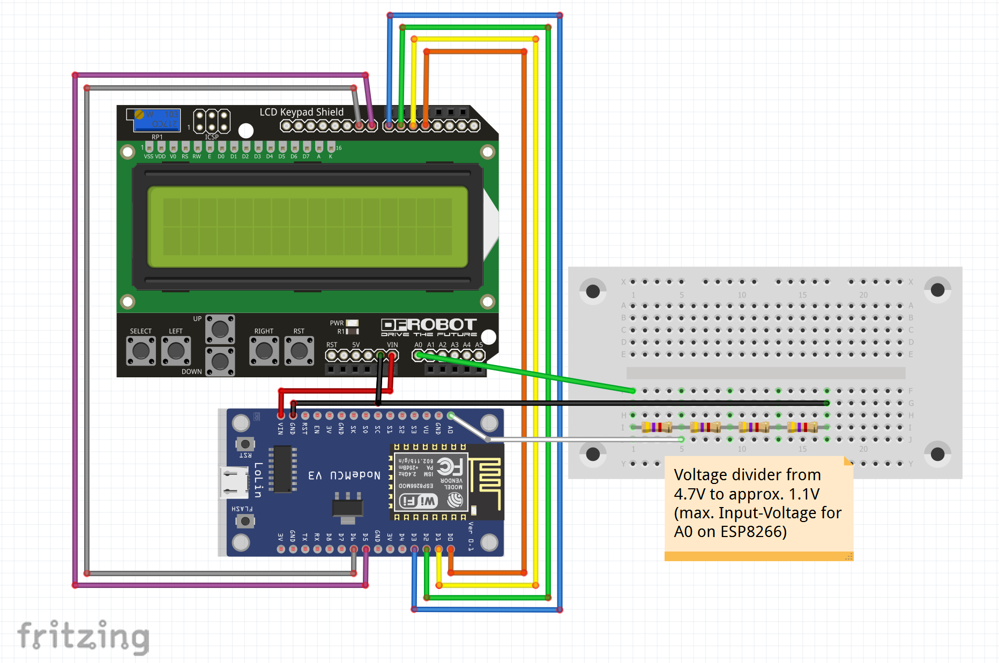

# ESP8266-LCD-1602-Keypad-Shield

A short minimal example on how to connect a LCD 1602 Keypad Shield (e.g. from SainSmart) with an ESP8266.

## Requirements

### Hardware
All you need is an ESP8266 board (e.g. Lolin NodeMCU v3), a LCD 1602 Keypad Shield (e.g. SainSmart LCD Keypad Shield v.1.0), some resistors (I used 4 x 4.7 kOhm) and some cables.

A breadboard can come in handy, but as you can see in my demo, I did not really make a lot of use.

### Software
You only need the Arduino IDE with installed packages for the ESP8266.

## Wiring

Please see the following wiring sketch for wiring:

## License

MIT License
